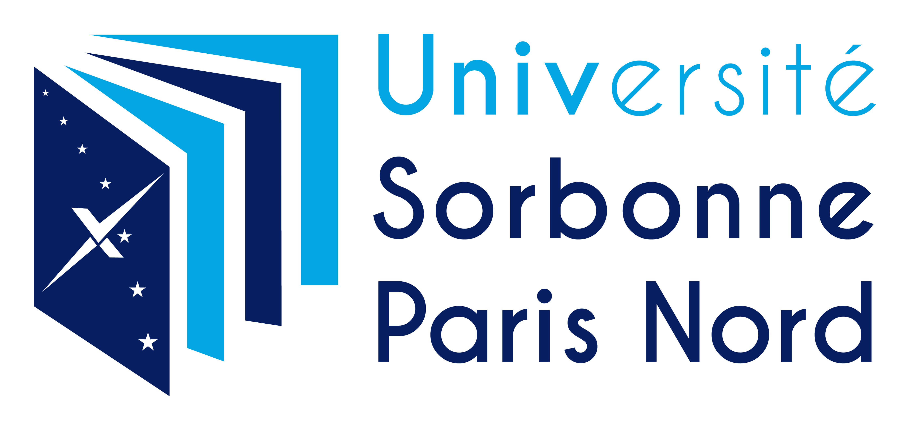

# Projects-BUT-Informatique 

### BUT (Bachelor University of Technology)

## Introduction
Welcome to the Projets-BUT-Informatique repository! Here, you will find a collection of projects that I have completed during the first two years of my studies at Université Sorbonne Paris Nord. This repository showcases both individual and group projects, allowing me to develop valuable skills in both teamwork and autonomy.

## Repository Content
The repository includes a diverse range of projects, covering various aspects of computer science. Each project highlights my growth and progress throughout my academic journey. I have tackled these assignments with dedication, employing my knowledge and creativity to deliver quality results.

## Collaborative Projects
Some of the projects in this repository were completed in collaboration with my peers. Working in a group setting provided me with valuable experiences in teamwork, effective communication, and collaborative problem-solving. Together, we successfully navigated challenges and leveraged our collective strengths to achieve outstanding outcomes.

## Individual Projects
In addition to group projects, I have also undertaken individual projects within this repository. These solo endeavors have allowed me to cultivate a sense of autonomy and self-reliance. By working independently, I honed my ability to manage projects from inception to completion, making critical decisions and exploring innovative solutions along the way.

## Conclusion
The Projets-BUT-Informatique repository serves as a testament to my growth as a computer science student. Through collaborative and individual projects, I have developed a comprehensive skill set, encompassing both teamwork and autonomy. Feel free to explore the repository and witness the results of my dedication and passion for computer science.
